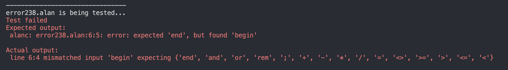
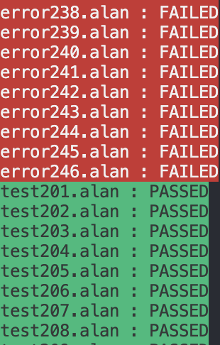

# Compilers Assignment 1 Test Suite

## :exclamation: :warning: !!BEWARE!! :warning: :exclamation:
**The test suite uses a different command to run the antlr files than the one prof uses. Make sure your code works as expected with prof's command before using this test suite. In particular the sematic predicates i.e the code in `{}`.**

## Installation

This is a very basic test suite to test the output of your ANTLR files.

Move the test_suite folder to the same directory as your ANTLR files.

Then just run `python3 test.py` from inside test_suite.

Additionally, you can run `python3 test.py 'starting_rule'` to set the starting rule of your grammar, by default it is set to `program`.

## Output

The program should output either PASSED or FAILED for each test case, if FAILED then it will show your output vs what was expected.

The program also displays the final results at the end in a table.

